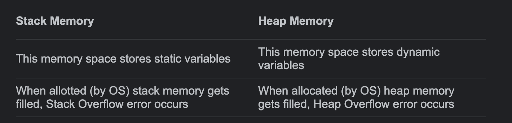
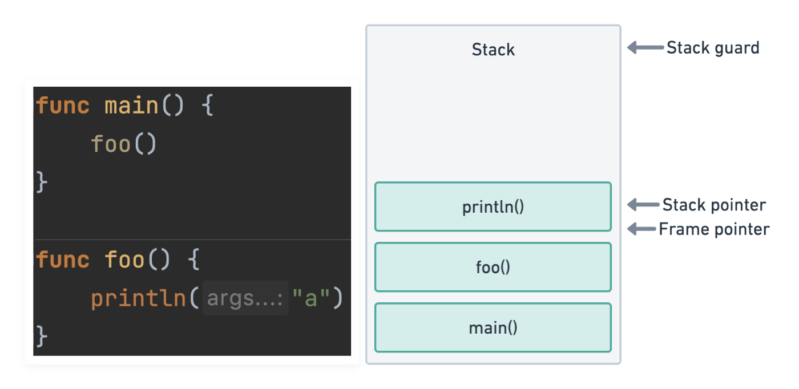

# GolangExamples


# Memory Allocation on Go

# Introduction

Memory allocation works in many different ways, on the many existing programming languages, although there are some similarities between them, we have some points specific to each one, which is one of the things that we want to bring on this article.

Like another languages, Golang has a stack and heap, where variables and function calls get allocated, let’s talk a little bit about it.

The stack and the heap(not the data structure) are contiguous memory blocks, that can grow dynamically on demand. The stack it’s basically where local, and function calls get saved, and the heap variables that are referenced on difference function, or does not exist only inside a function.

The key difference between these two characters, are:



Another difference is that the stack is really like the stack data structure, which means you will always have one element next to the other, with the LIFO logic. The heap isn’t organized like the stack, you can’t say who is the first or last element.

All the function calls are stored on the stack, and when the function returns, this allocated space gets freed. Which means, this logic, automatically free memory for the system.

With heap is a little bit different, as it’s meant to save dynamic data, memory here can be allocated or freed at any time. At this point, there are some programming languages where you need to allocate and free memory manually, while another have dynamic allocation and garbage collection. In C language for example, we don’t have garbage collector, or dynamic memory allocation, which means we need to allocate and free memory space manually.

Sometimes a memory allocator will perform maintenance tasks such as defragmenting memory by moving allocated memory around, or garbage collecting - identifying at runtime when memory is no longer in scope and deallocating it, which is one Golang characteristic, as well for another programming languages like Javascript, Java and C++.

So, for Golang and many other languages, we can consider that the compiler will decide which will be the best place to allocate memory for variables, as well when it’s the best time to garbage collect that variable.

This is basically magic, the compiler does everything to us, in the sense that we just need to focus on programming. For having a health application, that does not consume too much of our hardware, prioritizing effectiveness, these decisions are crucial, and may change depending how your application was built.

# Runtime and Memory Allocation

When a piece of code gets compiled and executed, all the function calls are stored like blocks on the stack, following the LIFO logic, so let’s consider that example:



We can see that the `main` function was the first one to be inserted on the stack, then it came `foo`, and finally `println`. Following the LIFO logic( last in, first out) `println` will be executed, and when it returns a value, it will be removed from the stack. All the local variables of that function are also stored on the reserved block for the function, and when the function returns, these variables also get removed.

On that example above, you can see that we don’t have variables that are shared between functions, we don’t even have defined variables.

Now that we’ve got the point, what happens when you created a recursive function, that never stops calling itself ? The famous stack overflow error will occur, which is when the amount of memory needed exceeds the previously allocated.

Now imagine that we have the following piece of code:

```go
func main2() {
   _ = stackIt2()
}
//go:noinline
func stackIt2() *int {
   y := 2
   res := y * 2
   return &res
}
```

`main2` will be inserted on the stack, and then `stackIt2` will be inserted. But now the second function returns a pointer, which is a reference to a value, and the compiler doesn’t know if this value is going to be used by another function, so most of the time this value will be allocated on the heap.

Note the part: “so most of the time...”, I’ve used these words, because it’s compiler decisions, there are some cases where pointers will be saved on heap, while in another cases, they will be saved on the stack.

# The Compiler Decides What is the Best

If the compiler can’t prove that certain variable is not referenced after a function returns, then it will save on the heap, to avoid possible pointer errors, also if it’s a very large variable, it would be better to store on the heap.

There are some packages and tools that we can use for benchmarking, and checking what was saved on the heap versus stack. Let’s take a look on that example:

```go
func main3() {
   y := 2
   _ = stackIt3(&y) // pass y down the stack as a pointer
}

//go:noinline
func stackIt3(y *int) int {
   res := *y * 2
   return res
}
```

Most of the time, if we run this code with the tools that capture memory allocation on runtime, we will check that there will be no heap allocations, because the compiler can judge if the pointer will be used on another function, because `y` isn’t referenced anywhere outside `main3`.

So, we can see that the compiler will always choose the best direction for effectiveness, but the way the developer writes the code, may affect that, and that is why structuring your code, and following the best practices are the way to appreciate the compiler’s hardwork.

# Memory Allocation and Performance

In the end of the day, we write code to bring value to some business, and to use our software to generate income to a company, or entity. So, that is why performance is one thing developers, tech leads and architects are really worried with, and what memory allocation has to do with that ? Everything!

Basically, the compiler will always seek the best approach to effectiveness, but the way we write our code may generate bottlenecks, memory leaks and many another performance problems.

That is where the first step to avoid this comes, which is following the best coding practices, and making sure that we are using the proper data structures for each of our use cases, always considering its space/time complexity.

Secondly, it’s something that we need to be concerned about, which is heap allocation. If we have two pieces of code:

```go
//go:noinline
func CreateCopy() BigStruct {
   return BigStruct{
      A: 123, B: 456, C: 789,
      D: "ABC", E: "DEF", F: "HIJ",
      G: true, H: true, I: true,
   }
}
//go:noinline
func CreatePointer() *BigStruct {
   return &BigStruct{
      A: 123, B: 456, C: 789,
      D: "ABC", E: "DEF", F: "HIJ",
      G: true, H: true, I: true,
   }
}
```

Probably, when running which of the functions separately, `CreateCopy` will have stack allocations,  while `CreatePointer` will have heap allocations.

If we create a program, that basically creates 200.000 instances of each struct, using both methods, we can check on benchmarks, that the total execution will be almost 100 times lazier on the heap allocation version.

The question is why ? Since the two functions are almost the same. But on `CreatePointer`, with all the heap reservations, the garbage collector will have a hard time on cleaning all the references on the heap.

While, on `CreateCopy`, everything gets deleted from stack, and we don’t need a garbage collector mechanism, to keep scanning for weak/closed references.

Most of the time, the allocations on heap comes from pointers, this means we need to delete all the pointers ? No, but we need to be careful and avoid unnecessary heap allocations when possible.

[https://medium.com/safetycultureengineering/an-overview-of-memory-management-in-go-9a72ec7c76a8#:~:text=Go's garbage collector is a,Let's break these terms down.&text=A mark and sweep garbage,that are no longer needed](https://medium.com/safetycultureengineering/an-overview-of-memory-management-in-go-9a72ec7c76a8#:~:text=Go's%20garbage%20collector%20is%20a,Let's%20break%20these%20terms%20down.&text=A%20mark%20and%20sweep%20garbage,that%20are%20no%20longer%20needed).

https://medium.com/eureka-engineering/understanding-allocations-in-go-stack-heap-memory-9a2631b5035d

https://medium.com/@ankur_anand/a-visual-guide-to-golang-memory-allocator-from-ground-up-e132258453ed

https://rcoh.me/posts/why-you-can-have-a-million-go-routines-but-only-1000-java-threads/
